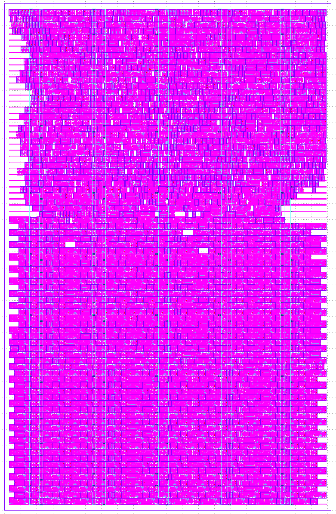

# Custom Flow

The design doesn't fit on two ihp tiles when using the Tiny Tapeout build flow.
That is why a custom librelane flow is used to place the large shift register more efficiently.

This flow is based on the [DFFRAM](https://github.com/AUCOHL/DFFRAM) compiler, but instead of creating a macro, it does everything in-place.

## Build

To build the GDS, run the following commands in the base directory of the cloned repository.
The resulting GDS can be found in `runs/ihp-sg13g2-sg13g2_stdcell/tt_um_snake_game/final/gds/`.

```sh
nix develop
# in case some nix-experimental-features are not enabled on your system:
# nix develop --extra-experimental-features nix-command --extra-experimental-features flakes
python3 build.py
```

**Note:**
I have not yet figured out how to install the ihp pdk along with nix+librelane.
You must install it yourself and change the following line in `build.py` accordingly.
I'm using the one you get when following the [Local hardenig](https://tinytapeout.com/guides/local-hardening/) guide.

```python
# TODO: install pdk along with nix flake
pdk_root = f'ttsetup/pdk/ciel/{pdk}/versions/cb7daaa8901016cf7c5d272dfa322c41f024931f'
```

## How it Works

Running `build.py` starts the custom *ShiftregFlow*, which differs from librelanes *Classic* flow by inserting two extra steps.
The first one places the Shiftregister, the second repairs it after some OpenROAD steps have broken it (multiple steps from `OpenRoad.GlobalPlacement` to `OpenRoad.DetailedPlacement`).
The flow files are in `librelane_plugin_shiftreg`, with the most important one being `librelane_plugin_shiftreg/scripts/odbpy/placeshiftreg/data.py`.
It handles both, placing and repairing, depending on when in the flow it is called.

### RTL

The shiftregister RTL `src/shiftreg.sv` is replaced by an ihp specific version `platform/ihp-sg13g2/shiftreg.sv`.
It is already mapped to the stdcells we want to use, including delay buffers to avoid hold violations.
Notably, it also reuses a single tiehi cell (source for a logic 1) to power 4 resetn ports in order to save some space.

### Placing

The step to place the shiftregister is called before any other stdcell has been placed.
We start roughly in the middle row and fill row-by-row in a zig-zag pattern, first down then back up again:
Flipflop, delay buffer, and occasionally tiehi and clock buffer.

This would be fine if not for two **minor** inconveniences:
1. Quite a few OpenROAD steps will move or replace already fixed stdcells.
Specifically, the `sg13g2_dlygate4sd3_1` used to add extra delay and avoid hold violations is replaced by a `sg13g2_buf_1` only for the following timing analysis to fail.
2. Clock-Tree-Synthesis will skip nets already containing a clock buffer.

The solution to 1. is to place the shiftregister using the `sg13g2_buf_1`, but add a few `sg13g2_fill_1` filler cells to block the same amount of space as a `sg13g2_dlygate4sd3_1`.
After detailed placement finished, the repair step then removes the filler and replaces the buffer with the correct delay gate.

The solution to 2. is to fill a block the size of a `sg13g2_buf_8` clock buffer with filler cells and remove them right before CTS.
TritonCTS actually manages to find and fill the holes (mostly and good enough).

### Result

The resulting placement (routing, filler, and decaps hidden) has the shift register in the bottom half and the remaining logic in the upper half.


